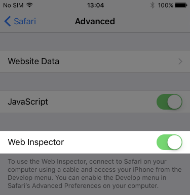
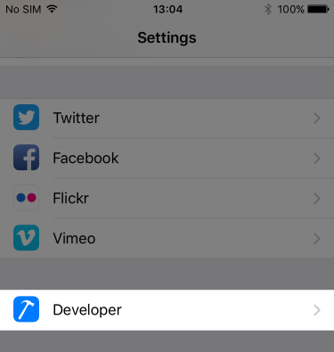
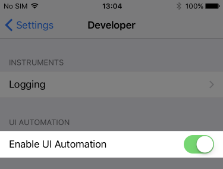
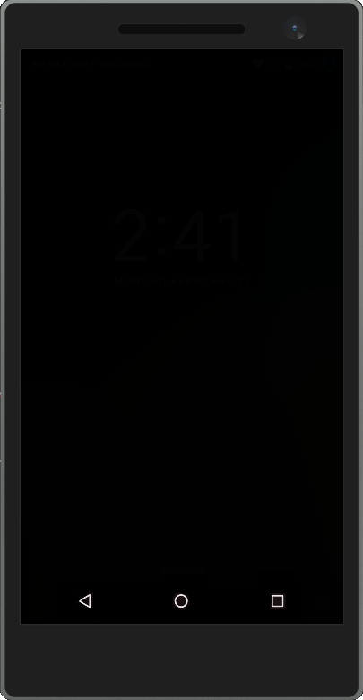

# Development Guide

This article outlines how to get started developing automation tests for ADAL & MSAL.

The automation tests are written in C# and currently only work on the full .NET Framework (there is no .NET Core support due to lack of CoreCLR
support from Appium/Selenium as well as ADAL.NET which is a dependency of the Azure Key Vault dependency).
As a result all test development must be done on a Windows PC. Although for Android and Windows Desktop test development this isn't an issue, for iOS/macOS
you will also require access to a Mac in order to both build/debug the automation apps (if required), as well as to use the iOS simulator or a physical iOS device.

## Configuration

> For more information about test configuration please see the full [Test Configuration](testconfig.md) article.

The `master` branch of the _TestAutomation_ repository is already set up for running tests on a local device/emulator. Minimal configuration is required
and should require no more than setting a few properties in the _config.local.json_ file. In general you need to do one/two things:

1. Set `deviceCapabilities:app` to the path of the automation test app
1. For iOS, set `ios:serverUrl` to the WebDriver endpoint of your Mac

## Setting up a Development Environment

### Android

Minimal effort should be required for Android development.

1. Download and install [Node.js for Windows](https://nodejs.org/en/download/)
1. Install and run Appium
   - `PS> npm install -g appium`
   - `PS> appium`
1. Set up your device/emulator..
   - For emulators: Install and start an Android emulator ([Android Studio Emulator](https://developer.android.com/studio/index.html), [Visual Studio Android Emulator](https://www.visualstudio.com/vs/msft-android-emulator/))
   - For real devices: Follow the instructions [here](https://developer.android.com/studio/run/device.html#developer-device-options).
1. Enter a path* to the app under test for `android:deviceCapabilities:app` in _config.local.json_
1. Build the solution and run the tests!

_\* Appium does **not** support installing app packages from UNC file paths; copy files locally first or map a network drive._

### Windows

1. Download and install the [Windows Appium Driver](https://github.com/Microsoft/WinAppDriver) (not required if you have already installed Appium)
1. Start the driver from a command prompt
  - Make sure the driver is listening on the port and address specified in the `desktop:serverUrl` in the _config.local.json_ file
    e.g. `WinAppDriver.exe 127.0.0.1 4723/wd/hub`
1. Build the [WinFormsAutomationApp](https://github.com/AzureAD/azure-activedirectory-library-for-dotnet/tree/dev/automation/WinFormsAutomationApp)
  - You might want to comment out the line that [clears out any cookies](https://github.com/AzureAD/azure-activedirectory-library-for-dotnet/blob/dev/automation/WinFormsAutomationApp/MainForm.cs#L17)
1. Enter the path to WinFormsAutomationApp in `desktop:deviceCapabilities:app` in _config.local.json_
1. Build the solution and run the tests

Appium will be trying to automate the test app running on your local machine by setting focus and sending key presses and clicks to the app.
It is possible to debug through the tests if you are careful, but it's easy to derail a test by changing focus or typing when Appium is trying
to communicate with the test app. It's best to avoid breaking in or single-stepping through sections of code where this is happening e.g. if
the test if filling in a page then clicking submit, break before the interaction starts and afterwards, but avoid between if possible.

#### iOS

Development for iOS requires both a Windows PC and a Mac which can see each other on the network. Developing on real iOS devices requires significant extra
set up and can be quite complicated; if possible try and use iOS simulators.

If you plan to run the automation apps on real iOS devices and do not already have an Apple ID (using your @microsoft.com address) joined to the Microsoft developement team,
you should request to join [here](http://iosdeploy.redmond.corp.microsoft.com/appledev/).

On your Mac…

1. Install the latest version of Xcode
1. Download and install [Node.js for macOS](https://nodejs.org/en/download/)
   - If you use Homebrew you can instead run the following command:
   - `$ brew install node`
1. Install and run Appium
   - `$ npm install -g appium`
   - `$ appium`
1. Grab the IP address / NetBIOS hostname of the Mac and note it down for later

On your Windows PC…

1. Enter the IP address or NetBIOS hostname of the Mac in the `ios:serverUrl` property in _config.local.json_
1. Enter the local path to the app **located on the Mac** under test for `ios:deviceCapabilities:app` in _config.local.json_
1. Build the solution and run the tests!

_\* This path is **local to the Mac** which is running Appium. If you wish to access a UNC path you must first mount the SMB share._

##### Additional setup for real iOS devices

- Follow the official Appium instructions [here](https://github.com/appium/appium/blob/master/docs/en/appium-setup/real-devices-ios.md)
- Go to _Settings > Safari > Advanced_ and enable the _Web Inspector_ option

- Go to _Settings > Developer_ and enable the _Enable UI Automation_ option
  - NB: This option will only be available after connecting the device to your Mac and installed the a developer Provisioning Profile

## Using Olympus Devices

Rather than using a local emulator/simulator or real device, you may also run a test locally that points at an Olympus-managed device.

1. Copy the `serverUrl` and `deviceCapabilities` properties from _config.vsts.json_ to _config.local.json_
1. Enter a path* to the app under test for `deviceCapabilities:app` in _config.local.json_
1. Build the solution and run the tests!

_\* The file path **must** be accessible from Olympus; use a public UNC file path._

## Writing and Debugging Tests

Please review the guidelines for writing automation tests here: [Test Structure](teststructure.md).

Be aware if you are executing tests against Olympus devices that if you sit at a breakpoint for a long time your session will be dropped – don't hog devices :)

## Requesting an Official Build

If you wish to run some E2E tests against your changes you may queue one of the existing official [Build Definitions](docs/builddefinitions.md) against your branch.

1. Go to the [VSTS Builds page](https://identitydivision.visualstudio.com/IDDP/_build)
1. Go to _All Definitions > E2E Tests_
1. Click the ellipsis next to the build definition you wish to queue and click "Queue new build…"

### ..for Android E2E

3. Set either _Branch_ or _Commit_ to select the source version of the **Android library and automation app** to test against. Default: `dev`
4. Set the _test_repo_branch_ variable to your feature branch in the **TestAutomation** repository. Default: `master`
5. (Optional) Add any additional configuration overrides as variables. See [VSTS Configuration](testconfig.md#VSTS_Configuration) section of the [Test Configuration](testconfig.md) article for more information.

### ..for iOS E2E

3. Set either _Branch_ or _Commit_ to select the source version of the **TestAutomation** repository. Default: `master`
4. Set the `ios:deviceCapabilities:app` variable to an Olympus-accessible (public UNC path) copy of an iOS Automation App (a dev-signed _*.app_).

## Troubleshooting & Known Issues

- Occasionally, on the Android emulator, a test failure seems to induce a bad state resulting is all other test failing. The screen will appear black and tests will hang.

  

  Restart the emulator to correct the issue.

- The tests logs are deleted for succesful test runs.

  There is no workaround.
