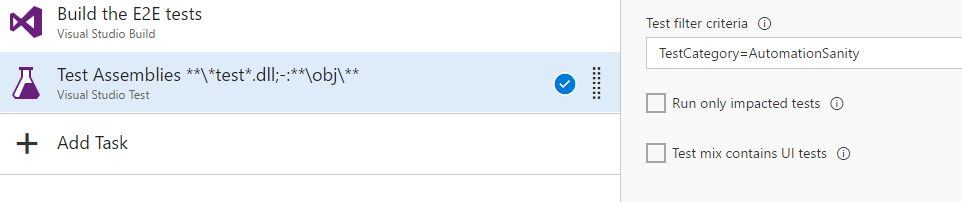

# Test Structure

Wherever possible all tests should follow the guidelines set out below.

## Common vs Platform-specific Tests

To minimise effort spent testing the same scenarios across all platforms (Android, iOS and Desktop), all scenario tests which are common (applicable to all platforms and follow the same set of actions),
should be placed in the _AutomationCore_ project. This project contains both the automation test framework as well as common tests.

The [`CommonTests`](../AutomationCore/Tests/CommonTests.cs) class has tests that apply to all platforms. The [`TestDriver`](../AutomationCore/Tests/TestDriver.cs) class contains high-level flows and also provides access to the 
[`TestApplication`](../AutomationCore/Tests/TestApplication.cs) object for low-level access over the app (e.g. button click, text input), to the [`DeviceDriver`](../AutomationCore/Driver.cs) (e.g. for context switching) and to the 
[`SignInOrchestrator`](../AutomationCore/SignIn/SignInOrchestrator.cs) that encapsulates the sign-in flows.

For example in the Android project:

```cs
[TestMethod]
[TestCategory(Api.AcquireToken), TestCategory(BehaveAs.Office), TestCategory(Federation.Managed), TestCategory(Platform.Android)]
[TestCategory(TestUse.AutomationSanity)] // this test should run as CI for the test repo
public void AcquireToken_Managed_Graph_NotFederated()
{
    new CommonTests(TestDriver, Logger).AcquireTokenTest(
           FederationProvider.None,
           Resource.Graph,
           ApplicationType.Office,
           new UserAttributes[0]);
}
```

For scenarios which only apply to a specific platform, the tests should be placed directly in the platform-specific 'head' test projects.

## Platform specific tests

See the tests in [`DesktopSpecificTests`](../DesktopTests/DesktopSpecificTests.cs) for an example. 

## Platform specific validation

See the test AcquireTokenTest_AdfsV3_Office_NotFederated from [`AdfsV3TenantTests`](../AndroidTests/AdfsV3TenantTests.cs) test for an example. 

## UI-less tests for .Net
Automating tests using Appium to control the UI is unavoidably slow and can be unreliable, but it is necessary to test the product UI and to
test on devices and platforms other than .Net. However, a subset of the test cases can be run without UI (i.e. those with only silent flows),
and that means it is possible to execute those tests for the .Net platform without using Olympus/Appium.

The UI-less .Net tests are under [DesktopTests\Headless](../DesktopTests/Headless).
The UI-less .Net test application is in the project [AdalHeadlessAutomationTestApp](../AdalHeadlessAutomationTestApp)

All of the UI-less tests are tagged with the test categories `Headless` and `NoProductUI`.
There is no product UI in any of those tests, but some of the tests have UI of their own (e.g. the the device code tests). Those tests are tagged with the category `TestUI`.
If you are debugging in VS and only want to run the UI-less tests you can use the following test filter in the _Test Explorer_: `Trait:"Headless" Trait:"NoProductUI" -Trait:"TestUI"`

### Building the UI-less tests against ADAL.Net binaries rather than a NuGet package
By default, the `TestAutomation` solution is built against a published ADAL.Net NuGet package.
The NuGet package version used is specified in [build settings](../build/TestAutomation.settings.targets) file.
All of the test projects in solution import the build settings file, so changing the NuGet package version that 
is referenced in the settings file will update all of the test projects.

The build settings file also provides a way to build the UI-less tests against ADAL.Net assemblies, rather
than by referencing a NuGet package. This can be useful when debugging or testing a new version locally. This
mechanim is also used by an ADAL.Net CI build that runs the UI-less desktop tests for every product code commit: [CI/ADAL.Net CI (Desktop UI-less e2e)](https://identitydivision.visualstudio.com/IDDP/_build/index?context=allDefinitions&path=%5CCI&definitionId=187)

To build the tests against ADAL.Net binaries, set the MSBuild property `$(AdalDesktopBinPath)`.
See the documentation in the build settings file for more information.


## Naming Convention

All tests should follow the same naming convention: `[API area under test]_[Category 0]_[Category 1]_..._[Category N]`.

Examples:

```cs
public void AcquireToken_Managed_Graph_NotFederated() { /*...*/ }
public void AcquireTokenAuto_Android_Managed_Graph_NotFederated() { /*...*/ }
public void AcquireTokenUsingNtlm_Adfs_Graph_Federated() { /*...*/ }
```

## Categories

Tests should be tagged with one or more of applicable test categories. There are several test categories defined in the [`TestCategories`](../AutomationCore/TestCategories.cs) class
and can be added to tests using the `[TestCategory]` attribute.

Category Set             |Description
-------------------------|-----------
`Platform`               |The device platform under test (Android, iOS, Desktop)
`Api`                    |The ADAL API that is under test
`Federation`             |?
`BehaveAs`               |?
`UserAttributeCollection`|?
`TestUse`                |(Optional) Tests that should be run as part of various benchmark test runs (e.g. BVT)

For example:

```cs
[TestMethod]
[TestCategory(Api.AcquireToken), TestCategory(BehaveAs.Office), TestCategory(Federation.Managed), TestCategory(Platform.Android)]
[TestCategory(TestUse.AutomationSanity)]
public void AcquireToken_Managed_Graph_NotFederated() { /*...*/ }
```

### Filtering Tests by Category in VSTS

To filter a VSTS test run to a specific set of tests by category you can specify a 'filter criteria' on the VSTest task using the Build Definition Editor on VSTS.



The filter syntax is the same syntax as the `vstest.console.exe /TestCaseFilter:FILTER` command-line argument. For more information about filter syntax see [here](https://blogs.msdn.microsoft.com/vikramagrawal/2012/07/23/running-selective-unit-tests-in-vs-2012-rc-using-testcasefilter/).
