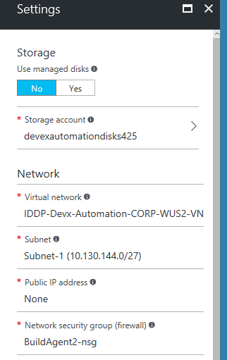
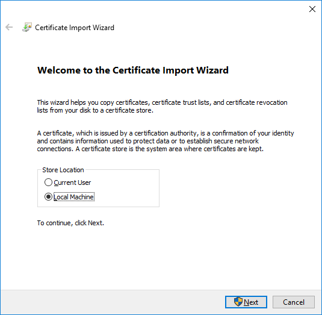
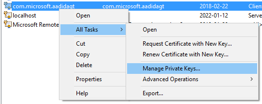
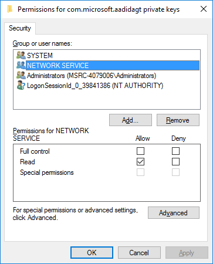

# VSTS Agents

For an overview of VSTS Build and Release Agents please see the [official VSTS documentation](https://www.visualstudio.com/en-us/docs/build/concepts/agents/agents).

VSTS Agents can only execute one build at a time. This means we are limited on the number of build definitions we can run concurrently (one per agent).
For build definitions which don't require any CorpNet access we can utilise one of the Hosted Agents (Windows & Linux) provided by VSTS, otherwise a on-premise agent is required.
An on-premise agent is required for Mac builds.

In order to run the ADAL end-to-end automated test suite an on-premise agent is required. This is because the tests utilise devices hosted on the internal Olympus
platform and therefore access to CorpNet is required.

On-premise agents are also required for builds which perform code signing tasks, again due to the need for CorpNet access.

## Creating Azure VMs for VSTS build

As mentioned above, the build agents need to be on CorpNet to be able to access Olympus, so we cannot use the Hosted build agents that VSTS offers. 
We have obtained an Azure subscription that should be used for Build and Test accounts. This subscription is different from the one the Lab uses to provision environments.

Subscription: MSID_DEVX_CAM_PPE  (ID: 57f88e5d-dc7d-422b-b87a-e215ad6a352c) 

This subscription is tied to CorpNet through the Express Route technology. Currently we have been assigned a small subnet that allows us to create up to 31 machines. To create a new VM:

1. Go to Virtual Machines and click "Add..."
2. Choose the OS, Win Server 2016 Datacenter works fine
3. In "Step 1" of the wizard, chose a name for the VM - currently we name them IDDP-Build1, IDDP-Build2 etc. Choose "DevEx_Automation" Resource Group. Make sure to remember the local admin account.
4. In "Step 2", choose a size - "DS2_V2 Standard" is good enough.
5. In "Step 3" change the Network to the existing one in the ERNetwork RG and set the Public IP Address to "None"
6. After the VM has been deployed, connect to it by RDP to its private IP address. Ping will not work! Domain join the machine and go to the next section.



## Setting up the VSTS Agent

The VSTS Agent is cross-platform written in .NET Core. Downloads are available directly from VSTS on the [Agent Queues](https://identitydivision.visualstudio.com/IDDP/_admin/_AgentQueue)
or [Agent Pools](https://identitydivision.visualstudio.com/_admin/_AgentPool) admin/settings pages.
Ensure you follow the steps outlined in the documentation for each platform
([Windows](https://www.visualstudio.com/en-us/docs/build/actions/agents/v2-windows),
[macOS](https://www.visualstudio.com/en-gb/docs/build/actions/agents/v2-osx),
[Linux](https://www.visualstudio.com/en-us/docs/build/actions/agents/v2-linux))
as there are a few important prerequistes for some platforms.

Run the configuration flow as admin.
The agent should be added the to [**DevEx Automation**](https://identitydivision.visualstudio.com/_admin/_AgentPool?poolId=5) agent pool.
The other options have good defaults.
Make sure you configure the build agent to run as a service, otherwise if the machine restarts the build agent becomes unavailable. 


### Installing Additional Software on the Build Agent

- Install Visual Studio (e.g. 2017)
- Install Visual Studio 2015 build tools https://www.microsoft.com/en-us/download/details.aspx?id=48159 
- Install the JAVA SDK and set the JAVA_HOME env variable. Make sure the java bin is added to the path - %JAVA_HOME%\bin
- Install the Android SDK to a location with a path with no spaces in it. Do not install it as part of Visual Studio. Set the ANDROID_HOME env variable.

Important Note: the build agent service needs to be restarted for the env variable changes to occur!

### Additional Setup to run End-to-End Automated Tests

There are [several build definitions](builddefinitions.md) set up for each platform: PR builds, CI builds, release/signed builds, and E2E automation test runs.

In order to successfully run the E2E tests the agent needs access to the MSIDLab Key Vault (to get passwords of the various test accounts).


If the agent is running under the identity of a user which already has the 'List' and 'Get' Key Vault permissions then no extra agent configuration is required.
However, changes to the [test configuration](testconfig.md) will be required to override the default bevahiour which is to use a certificate. These can be specified
at build queue-time using VSTS variables, or by environment variables on the host machine.

```batch
REM Override configuration to authenticate to Key Vault using the current user identity
SET keyVault:authType="UserCredential"
SET keyVault:clientId="1950a258-227b-4e31-a9cf-717495945fc2"
```

If the agent is running as a service (which by default runs as the _Network Service_ [`NT AUTHORITY\NETWORK SERVICE`] account) then access can be obtained via an X509 certificate.
An AAD Application with certificate key credentials has already been configured for this purpose and has all the nessesary Key Vault permissions.
The [test configuration](testconfig.md) is already set up for authentication using this certificate thumbprint and application combination.

#### Installing the Certificate

The certificate is in the [BuildAutomation KeyVault](https://ms.portal.azure.com/#resource/subscriptions/57f88e5d-dc7d-422b-b87a-e215ad6a352c/resourceGroups/DevEx_Automation/providers/Microsoft.KeyVault/vaults/BuildAutomation/overview).
This is the secret named [com-microsoft-aadidagt](https://ms.portal.azure.com/#resource/subscriptions/57f88e5d-dc7d-422b-b87a-e215ad6a352c/resourceGroups/DevEx_Automation/providers/Microsoft.KeyVault/vaults/BuildAutomation/overview).

The certificate should be installed in the personal certificate store of
either the local machine or the service account user. You must also grant permission to manage the private key of the certificate to the account running the VSTS agent.

##### Via PowerShell

```powershell
$pfxPath = 'C:\certificate.pfx' # or where ever you have the PFX file on your machine
$agentAccountName = 'NT AUTHORITY\NETWORK SERVICE' # or which ever user the VSTS agent service is running under, e.g., 'REDMOND\BILLG'

# Install certificate to local machine 'personal' store
$certificate = Import-PfxCertificate -FilePath $pfxPath -Exportable -CertStoreLocation Cert:\LocalMachine\My

# Compute path to private key on disk
$privateKeyPath = "${env:ProgramData}\Microsoft\Crypto\RSA\MachineKeys\" + $certificate.PrivateKey.CspKeyContainerInfo.UniqueKeyContainerName

# Create new access rule
$newRule = New-Object System.Security.AccessControl.FileSystemAccessRule $agentAccountName, 'Read', 'Allow'

# Update ACL
$acl = Get-ACL -Path $privateKeyPath
$acl.AddAccessRule($newRule)
Set-ACL -Path $privateKeyPath -AclObject $acl
```

##### Via GUI & MMC

###### Import the certificate

1. Double-click the PFX file to begin the import process, selecting the 'Local Machine' as the destination store



###### Granting permission to private keys

1. Continue clicking 'Next' and 'Finish' accepting all the defaults. You should not be prompted for a password as you should have been granted permission to import the certificate via group membership.
1. Open MMC from Start > Run
1. File > Add/Remove Snap-in...
1. Select Certificates and click 'Add'
1. Select 'Computer account' and click 'Next'
1. Select 'Local computer' and click 'Finish', then click 'OK'
1. Under Certificate (Local Computer) > Personal > Certificates, right-click the _com.microsoft.aadidagt_ certificate
1. Select All Tasks > Manage Private Keys... on the context menu



9. Add the user account under which the VSTS agent is running, granting 'Read' permissions.


